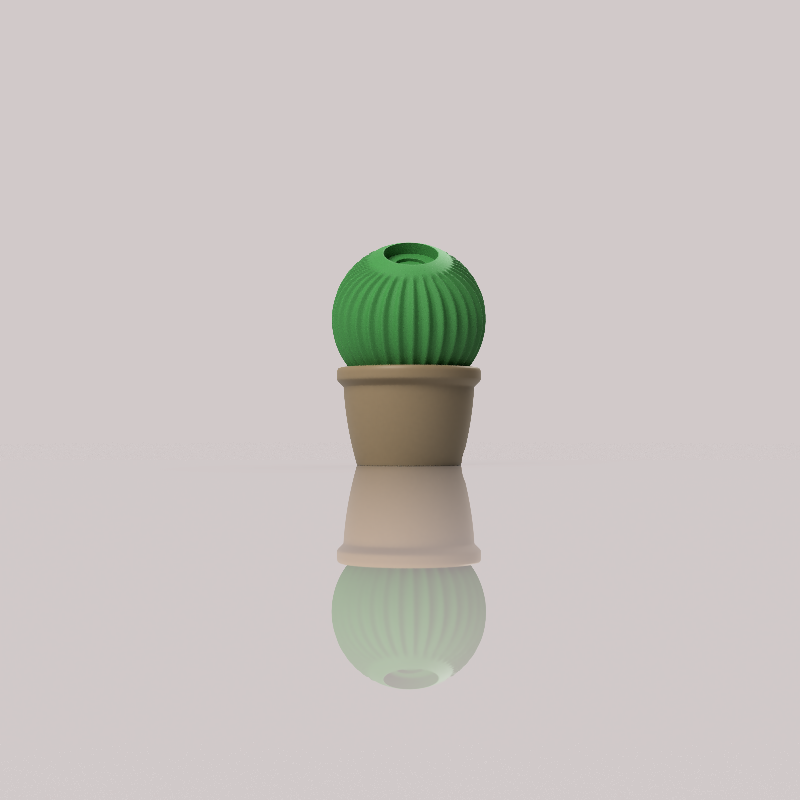

# Cactus
Small Python script that generates a cactus sphere STL used as the base for the Apple Watch charger.

## Requirements

- Python 3
- `numpy` for mesh generation

```bash
pip install -r requirements.txt
```

## Usage

Generate an STL with default settings:

```bash
python main.py --out cactus_ball.stl
```

Useful parameters: `--radius`, `--ribs`, `--depth`, `--cap_angle_deg`, `--lid_angle_deg`.

## Charger
